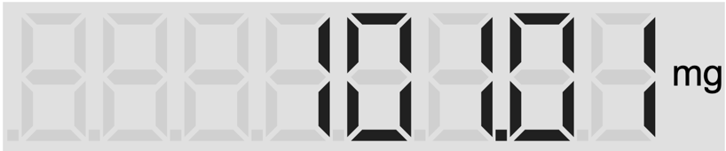
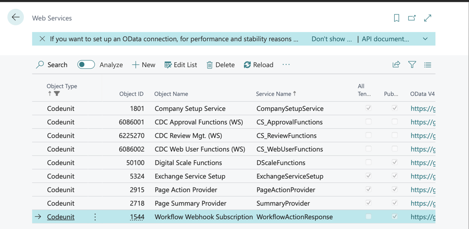
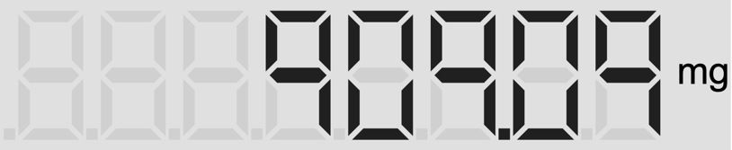
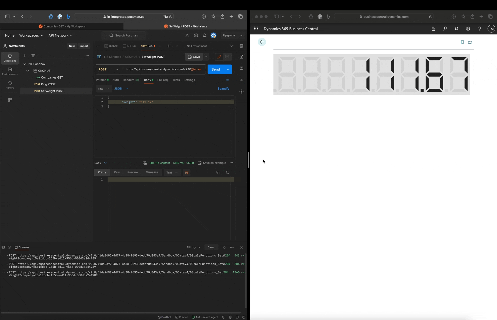

# DigitalScale
The DigitalScale project aims to provide an efficient and intuitive solution for displaying measured values in Microsoft Dynamics 365 Business Central. It uses 7-segment displays for a clear and easy-to-understand visualization of numerical values that are sent to Business Central via an API.



The project is based on the library by [Chris Webb](https://medium.com/@Chris_Webb) - Medium, which was published via [Build a Seven Segment Display in JavaScript](https://javascript.plainenglish.io/build-a-seven-segment-display-in-javascript-8822a7332c70) on 10/10/2020.
The complete code is available at [GitHub](https://github.com/marquardt-informatik/DigitalScale).

## DigitalScaleDisplay.al
```
/// <summary>
/// ControlAddIn DigitalScaleDisplay.
/// </summary>
controladdin DigitalScaleDisplay
{
    Scripts = 'digiscale/DigiScale.js', 'digiscale/seven_segment_display.js', 'digiscale/seven_segment_display_page.js';
    StartupScript = 'digiscale/DigiScaleStatup.js';
    StyleSheets = 'digiscale/DigiScale.css';
    VerticalStretch = true;
    HorizontalStretch = true;

    /// <summary>
    /// OnControlAddInReady.
    /// </summary>
    event OnControlAddInReady();
    event RefreshPage();

    procedure SetValue(Value: Decimal; UnitOfMeasure: Text);
    procedure SetNumberOfDigits(Digits: Integer);
    procedure SetDecimalPlaces(DecimalPlaces: Integer);
    procedure Render(HTML: Text);

    procedure StartTimer(milliSeconds: Integer);
    procedure StopTimer();
}
```
You must then create the files `DigiScaleStatup.js` and `DigiScale.js` in order to connect the JS files specified above to Business Central.

## DigiScaleStatup.js
```
HTMLContainer = document.getElementById("controlAddIn");
Render('<svg id="SVGSSD" width="100%" height="100%" xmlns="http://www.w3.org/2000/svg" xmlns:xlink="http://www.w3.org/1999/xlink"></svg>');

let SSD = new SevenSegmentDisplay("SVGSSD");

Microsoft.Dynamics.NAV.InvokeExtensibilityMethod('OnControlAddInReady', []);
```
With `Render()` an SVG image is created within the DIV container controlAddIn, which later contains the paths of the 7-segment display.

## DigitalScale.js
This file contains the publicly accessible functions that are made known via the definition of the Business Central ControlAddIn.
```
function SetValue(value, uom) {
    let SSD = new SevenSegmentDisplay("SVGSSD");
    SSD.Value = value;
    SSD.Unit = uom;
}

function SetNumberOfDigits(value) {
    let SSD = new SevenSegmentDisplay("SVGSSD");
    SSD.NumberOfDigits = value;
}

function SetDecimalPlaces(value) {
    let SSD = new SevenSegmentDisplay("SVGSSD");
    SSD.NumberOfDecimalPlaces = value;
}

function Render(html) {
    HTMLContainer.insertAdjacentHTML('beforeend', html);
}

function StartTimer(milliSeconds) {
    timerObject = window.setInterval(TimerAction, milliSeconds);
}

function stopTimer() {
    clearInterval(timerObject);
}

function TimerAction() {
    Microsoft.Dynamics.NAV.InvokeExtensibilityMethod(
        "RefreshPage",
        arguments,
        false,
        () => {
            // Invoking the AL trigger has completed, invoke
            // the AL trigger again in 10 seconds
            window.setInterval(() => {
                TimerAction();
            },
                milliSeconds);
        },
        () => { /* error handling and perhaps retrying */ });
}
```

## Integration of the ControlAddIn
I have included DigitalScaleDisplay as the only element in `page 50100`. The code states that the RefreshPage trigger is called every 200 milliseconds. This reads the current value from the IsolatedStorage and updates the measured value display. I will show you how to change the value from the IsolatedStorage in the following section.

```
/// <summary>
/// Unknown IOI.
/// </summary>
namespace IOI.DigitalScale;

page 50100 DigitalScalePage
{
    PageType = Card;
    ApplicationArea = All;
    UsageCategory = Administration;

    layout
    {
        area(content)
        {
            usercontrol(DigitalScaleDisplay; DigitalScaleDisplay)
            {
                ApplicationArea = All;
                trigger OnControlAddInReady();
                begin
                    CurrPage.DigitalScaleDisplay.StartTimer(TimerMiliseconds);
                end;

                trigger RefreshPage()
                var
                    DigitalScaleValueText: Text;
                begin
                    if IsolatedStorage.Get('DigitalScaleValue', DigitalScaleValueText) then
                        if Evaluate(DigitalScaleValue, DigitalScaleValueText) then;
                    StartMeasurement();
                end;
            }
        }
    }
    var
        DigitalScaleValue: decimal;
        TimerMiliseconds: Integer;
        UOM: Text;

    trigger OnOpenPage()
    begin
        TimerMiliseconds := 200;
        DigitalScaleValue := 0.0;
        UOM := 'mg';
    end;

    local procedure StartMeasurement()
    begin
        CurrPage.DigitalScaleDisplay.SetValue(DigitalScaleValue, UOM);
    end;
}
```

## Receive measured values
I have decided not to provide Business Central with an API via a page. Here is the implementation:

```
codeunit 50100 "Digital Scale Functions"
{
    trigger OnRun()
    begin
    end;

    /// <summary>
    /// SetWeight.
    /// </summary>
    /// <param name="weight">text.</param>
    procedure SetWeight(weight: text)
    begin
        IsolatedStorage.Set('DigitalScaleValue', weight);
    end;
}
```

After the extension has been uploaded, this endpoint still needs to be configured in Business Central.


## Test run

`https://api.businesscentral.dynamics.com/v2.0/{{tenantId}}/((environment))/ODataV4/DScaleFunctions_SetWeight?company={{companyId}}`

Request Body
```
{
        "weight": "909.09"
}
```




